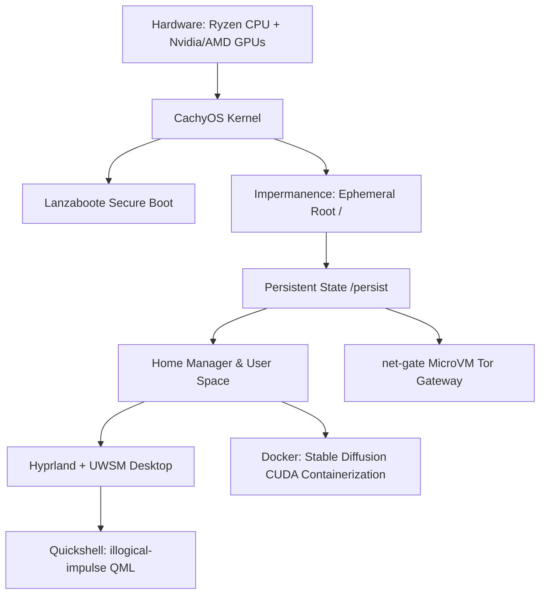

<div align="center">

# Vol NixOS: VOL(ATILE) NIXOS


<p>
  
  
  
  
  
  
  
  
  <a href="https://github.com/lowcache/volnixos/commits/main"></a>
</p>
</div>

A declarative, highly optimized, and ephemeral NixOS system configuration based on Nix Flakes. This setup integrates advanced system virtualization, low-latency performance kernels, encrypted secret management, secure boot configurations, and a bespoke Qt6/QML window manager desktop shell.

---

> [!WARNING]
> **Hardware Specificity & Replication Warning**
> This configuration is highly tailored and proprietary to a specific hardware environment (Ryzen CPU + AMD/Nvidia Hybrid GPU ASUS Laptop) and local user setups. To replicate or port this configuration to other systems, the following must be adjusted or removed:
>
> 1. **ASUS Laptop Daemons:** The `asusd` service and `supergfxd` integration in `configuration.nix`.
> 2. **Hybrid GPU Modules & Drivers:** Dual `amdgpu` and `nvidia` kernel parameters, blacklists, and video drivers (`services.xserver.videoDrivers = [ "nvidia" "amdgpu" ]`).
> 3. **Hardware Acceleration & CUDA Packages:** Nvidia-specific packages (`nvidia-vaapi-driver`, `nvtopPackages.nvidia`) and GPU-accelerated runners (`pkgs.ollama-cuda`, Docker OCI GPU passthroughs `--device nvidia.com/gpu=0`).
> 4. **Impermanence Disk Mapping:** Hardcoded directory bounds mapping user files to the unprivileged user's home directory (e.g., `/persist/home/<username>`). Update the username and user directories under `home/persist.nix` and `nixos/configuration.nix` to match your target `$HOME`.
> 5. **SOPS-Nix Secrets:** System password hashes inside `secrets.yaml` decrypted by the SSH host keys `/persist/etc/ssh/ssh_host_ed25519_key`. You must replace `secrets.yaml` with your own age-encrypted credentials.
> 6. **UEFI Lanzaboote PKI:** Hardcoded path `/etc/secureboot` for boot signature bundles.
>
> **💡 Need a hardware-independent build?** You can skip these modifications entirely by using the pre-configured **`limbo`** profile, a clean, generic version of this system designed to run on any standard x86_64 hardware. See [Section 5](#5-limbo-hardware-independent--clean-replicable-config) for details.

---

## 1. System Architecture Overview



### 1.1 Declarative Package Engine: Lix
The standard C++ Nix daemon is replaced with **Lix** (via `lix-module`), a modern, high-performance implementation focused on speed and reliable flake evaluations.

### 1.2 Ephemeral Root & Impermanence
This machine employs the **Impermanence** paradigm (`nix-community/impermanence`). 
* The root filesystem (`/`) is wiped or rebuilt on every boot, keeping the OS entirely clean.
* Important files, cache states, configurations, and user directories are mapped selectively onto a persistent partition at `/persist`.
* **Out-of-store Symlinks:** Dotfiles in user space are mapped via `config.lib.file.mkOutOfStoreSymlink` to the git repository under `/persist$HOME/.nix-config/dots/`. This allows modifications in the repository (e.g., config changes) to take effect instantly without needing a full `home-manager switch`.

### 1.3 CachyOS High-Performance Kernel & Sysctls
A custom-configured CachyOS Kernel (`pkgs.cachyosKernels.linuxPackages-cachyos-latest`) is compiled with extreme low-latency performance characteristics:
* Full preemption model (`preempt=full`) and thread IRQs (`threadirqs`) for real-time interactivity under high load.
* Sysctl-level kernel overrides for refined memory and scheduling control:
  * Highly aggressive virtual memory mapping (`vm.max_map_count = 2147483642`) and swappiness (`vm.swappiness = 180`).
  * Scheduling bandwidth slices optimized (`kernel.sched_cfs_bandwidth_slice_us = 3000`).
  * High-throughput network tuning incorporating BBR congestion control (`net.ipv4.tcp_congestion_control = bbr`) and fq queueing disciplines (`net.core.default_qdisc = fq`).
  * Dedicated GPU stability overrides to counter AMD + NVIDIA hybrid GPU and Ryzen C-state conflicts (`processor.max_cstate=1`, `amdgpu.gpu_recovery=1`).

### 1.4 Native UEFI Secure Boot & Cryptography
* **Lanzaboote:** Native integration (`nix-community/lanzaboote`) implements secure boot without disabling hardware locks by generating and registering key bundles under `/etc/secureboot`.
* **SOPS-Nix:** Secret files are encrypted via Mozilla SOPS inside `secrets.yaml` and decrypted locally on boot using host age SSH keys (`/persist/etc/ssh/ssh_host_ed25519_key`) to populate system user and root passwords securely.

### 1.5 Tor Anonymity Gateway (MicroVM)
An isolated background gateway MicroVM named `net-gate` is run declaratively via **microvm.nix**:
* Powered by `cloud-hypervisor` utilizing VSOCK CID bindings and a 1 VCPU / 512MB RAM minimal memory allocation.
* Automatically launches a transparent **Tor proxy** routing DNSPort (`5353`) and TransPort (`9040`) for secure client interactions.
* Placed on a virtual host tap network (`vm-netgate`) with local network boundaries (`192.168.100.1/24`) and explicit host-side systemd-networkd isolation rules. NetworkManager is instructed to treat the tap as unmanaged to prevent overlap.

### 1.6 GPU CUDA-Accelerated Containerization & Services
The system is configured as an AI development workstation:
* **Docker OCI Configurations:** Declarative, non-autostarting stable diffusion services for **Fooocus** and **Forge WebUI** equipped with direct host Nvidia GPU hardware passthrough (`nvidia.com/gpu=0`).
* **Local AI Stack:** An Ollama runner backed by CUDA-compiled dependencies (`pkgs.ollama-cuda`) and Open-WebUI run system-wide, integrated dynamically with ffmpeg binaries.
* **Nix-LD Wrapper:** An exhaustive compilation of standard and graphics-related libraries are configured within `nix-ld` to run unpatched Linux binaries (including CUDA/OpenGL drivers) natively.

---

## 2. Graphical Rice & User Experience: "illogical-impulse"

The desktop setup operates on **Hyprland** launched under the **Universal Wayland Session Manager (UWSM)** to handle systemd-managed environmental boundaries, using **tuigreet** and `greetd` as the primary greeter.

```
~/.nix-config/dots/
├─quickshell/
│ └─ii/                # Bespoke Qt6/QML shell environment
├─illogical-impulse/   # Custom colorschemes and updates config
├─kitty/               # Modus Vivendi / Custom GPU terminal themes
├─starship/            # Custom starship prompt profiles
├─fuzzel/              # Application launcher ini files
├─wlogout/             # Custom Wayland logout layout and stylesheet
└─cava/                # Console audio visualizer configuration
```

### 2.1 Bespoke Quickshell Panel (ii)
The user interface features a deep desktop shell written using **Quickshell** (QML + Qt6). 
* Renders system panels, dynamic workspace icons, status trackers, and resource indicators directly onto Wayland.
* System variables dynamically expose custom Qt6 paths and `QML2_IMPORT_PATH` directories to load libraries cleanly from both system profiles and local directories.
* Includes custom utilities like a screenshot tool (utilizing grim, slurp, and swappy) and custom overlays.

### 2.2 JSON Theme Colorscheme Engine
Instead of generic wallpaper generation, this setup relies on a highly sophisticated, custom-built colorscheme compiler engine (`apply_theme.py` / `apply_theme.bin` under `~/.config/illogical-impulse/scripts/`).
* Reads structured JSON theme matrices stored under `~/.nix-config/dots/illogical-impulse/themes/` (such as `petrified_spittoon.json`, `vivendi_tinted.json`, `horizon_neon.json`, and `skumring.json`).
* Parses theme palettes and mapping schemas to dynamically patch color configurations in real time across different components:
  * **`Appearance.qml`**: Recompiles material and semantic roles to dynamically adjust Quickshell styling.
  * **Hyprland Borders**: Injects matching border highlights into `~/.config/hypr/hyprland/colors.conf`.
  * **Kitty Terminal**: Rewrites terminal colors and tab-bar layouts in `~/.config/kitty/current.conf` and `~/.config/kitty/tab_bar.py`.
  * **Starship Prompt**: Synthesizes custom palette hashes directly inside `~/.config/starship.toml`.
* The pipeline integrates with `switchwall.sh` and `applycolor.sh` to programmatically update wallpaper positions on multiple monitors and hot-reload virtual terminal color escape sequences (`/dev/pts/*`) along with Qt/Kvantum assets dynamically.

### 2.3 System Welcome Banner: `volinit`
A custom-developed terminal system information fetch and stylized ASCII art banner application (`volinit`) is packaged natively:
* Pulled declaratively via Nix Flakes input bindings from the upstream repository `lowcache/volinit`.
* Runs instantly on launch to provide an aesthetic, low-overhead system status display.
* Tracked locally under `~/CodeRepo/volinit/` and can be pushed/pulled independently, then updated globally using `nix flake update volinit`.

### 2.4 Advanced Work Safety Daemon
Inside the `illogical-impulse` configurations lies a highly advanced safety filter:
* Continuously scans networks for specific SSID keywords (e.g., "cafe", "public", "school", "guest").
* When a target network is active, the system triggers the `workSafety` policy to automatically filter clipboards and prevent background loads of explicit sites or NSFW wallpapers in public environments.

---

## 3. Directory and Configuration Layout

* **`flake.nix`**: System inputs, CachyOS kernel overlays, lanzarboote/sops imports, `volinit` fetch modules, and system configurations mapping.
* **`nixos/`**:
  * `configuration.nix`: Main hardware definitions, system services, Docker OCI setups, greetd settings, Nix-LD graphics libraries, and kernel parameter flags.
  * `vms.nix`: Declares `net-gate` MicroVM configuration, Tor services, and systemd-networkd TAP rules.
  * `hardware-configuration.nix`: Physical file system mounts and host boot requirements.
  * `secrets.yaml`: SOPS-encrypted passwords and private keys.
* **`home/`**:
  * `default.nix`: Imports desktop GTK, user state values, and modular directories.
  * `pkgs.nix`: Houses explicit developer tools, Qt6 libraries, custom desktop engines, and pre-configured AI MCP servers.
  * `persist.nix`: Impermanence mapping rules specifying directories and out-of-store symlink coordinates.
  * `session.nix`: Strict global path exports, including crucial `QML2_IMPORT_PATH` entries for custom panels.
  * `shell.nix`: Fish configurations, git signatures, terminal profiles, and custom operational scripts.
  * `browsers.nix`: Hardware-accelerated Brave (Chromium) settings alongside secondary Floorp browsers.

---

## 4. Key Scripts & Management Commands

To facilitate fast operations, the shell is loaded with precise, specialized Fish functions and aliases:

### 4.1 System Rebuilding
* **`nxrbs`**: Runs a full NixOS system rebuild and applies changes on-the-fly from the local flake:
  ```bash
  sudo nixos-rebuild switch --flake /persist$HOME/.nix-config/#volnix
  ```
* **`nxrbb`**: Dry-builds the system configuration to test for compilations and evaluation failures:
  ```bash
  sudo nixos-rebuild build --flake /persist$HOME/.nix-config/#volnix
  ```

### 4.2 Workspace Operations
* **`priv-sync`**: Safely rsyncs live persistent directories (Documents, Pictures, repos, Gemini configs) from the ephemeral home directory space into the secure backing repository path:
  ```bash
  priv-sync
  ```
* **`setwall`**: Instantly changes wallpapers globally or on a specified monitor, dynamically running theme scripts to update the active Quickshell theme:
  ```bash
  setwall ~/Pictures/my_wallpaper.png DP-1
  ```
* **`gpgkey`**: Generates high-strength 4096-bit RSA keys using GPG and automatically exports the armored public key to the working directory.
* **`extract`**: Universal archive extraction helper handling complex compressed profiles (.tar.zst, .tar.xz, .zip, etc.).
* **`fooogo` / `fooostp`**: Starts or stops the containerized Fooocus stable diffusion environment.
* **`forggo` / `forgstp`**: Starts or stops the containerized Forge stable diffusion UI environment.

---

## 5. Limbo: Hardware-Independent & Clean Replicable Config

The **`limbo`** configuration profile provides a generic, non-opinionated, hardware-independent version of this NixOS system that is highly portable and runs cleanly out of the box on standard x86_64 systems (including physical machines and virtual machines). 

It is completely decoupled from all proprietary features of `volnix`, meaning it excludes:
* Lanzaboote Secure Boot (reverts to standard **`systemd-boot`**)
* Impermanence and root on RAM (uses a standard, reliable persistent filesystem partition scheme)
* SOPS-Nix encrypted secrets (uses declarative initial passwords)
* Hybrid AMD/Nvidia GPU drivers and Ryzen parameters (runs on generic CPU and open display drivers)
* Specialized hardware services like ASUS daemons and cachyos kernel packages

### 5.1 Directory Layout
The Limbo configuration files are completely isolated under the [nixos/limbo](file:///home/lowcache/.nix-config/nixos/limbo) directory:
* **[nixos/limbo/configuration.nix](file:///home/lowcache/.nix-config/nixos/limbo/configuration.nix)**: Stripped-down base services, including desktop environment (Hyprland), clean Nix-LD unpatched libraries, Docker engine, Fish shell, and CPU-only services for Ollama and Open-WebUI.
* **[nixos/limbo/hardware-configuration.nix](file:///home/lowcache/.nix-config/nixos/limbo/hardware-configuration.nix)**: Standard physical disk maps for typical Linux installations.

### 5.2 Disk Partitioning & Labeling
To install and run Limbo successfully, partition your target drive using a standard layout and assign the exact labels listed below (e.g., using `parted` / `gparted` / `fdisk` / `mkfs`):

| Mount Point | File System | Target Partition Label | Description |
| :--- | :--- | :--- | :--- |
| `/boot` | `vfat` (FAT32) | `boot` | EFI System Partition |
| `/` | `ext4` | `nixos` | Root Partition |

### 5.3 Installation Walkthrough
1. **Boot from a NixOS Installer:** Insert a standard minimal or graphical NixOS Live ISO.
2. **Mount partitions:** Label your partitions and mount them onto `/mnt`:
   ```bash
   # Mount root partition
   mount -t ext4 /dev/disk/by-label/nixos /mnt
   
   # Mount boot partition
   mkdir -p /mnt/boot
   mount -t vfat /dev/disk/by-label/boot /mnt/boot
   ```
3. **Clone the Configuration:** Clone this repository directly to the target system:
   ```bash
   git clone https://github.com/lowcache/volnixos.git /mnt/home/inlimbo/.nix-config
   ```
4. **Run Installation:** Install the system specifying the `limbo` profile:
   ```bash
   nixos-install --flake /mnt/home/inlimbo/.nix-config#limbo
   ```
5. **Reboot and Login:**
   * **Root user initial password:** `root`
   * **Standard user (`inlimbo`) initial password:** `nixos`
   * *⚠️ Set custom passwords immediately after logging in using the `passwd` command.*

### 5.4 Rebuilding & Managing Limbo
To build or switch configurations on an active Limbo system, use standard Nix flake rebuild commands:
* **Switch system configuration:**
  ```fish
  sudo nixos-rebuild switch --flake ~/.nix-config#limbo
  ```
* **Dry-build system configuration:**
  ```fish
  nixos-rebuild build --flake ~/.nix-config#limbo
  ```
