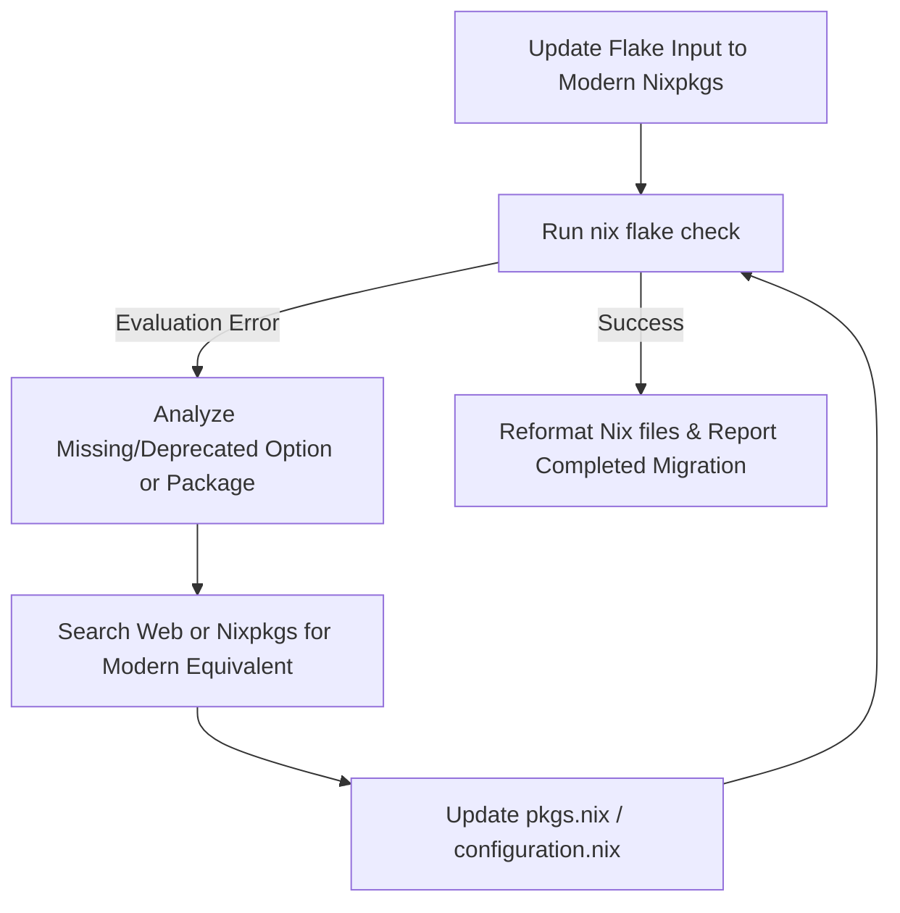

# Upgrading Kalinix to Modern Nixpkgs & Refactoring Packages

This document details the implementation plan to migrate the entire `kalinix` configuration from the legacy 2021 `nixpkgs` channel to a modern stable NixOS channel (e.g., `nixos-23.11` or `nixos-24.05`). 

By migrating to a modern channel, we will completely eliminate the legacy evaluation fallbacks (`nonEmptyStr`, `warnIf`, `replaceString`, `types.pkgs`, and `nix.enable` overrides), giving you up-to-date pentesting utilities, modern security patches, and full native support for `microvm.nix` out of the box.

To accomplish the heavy lifting of researching, mapping, and resolving package deprecations in `pkgs.nix` (such as obsolete Python 3.9 references), we will spin up a specialized, autonomous **Nix Upgrader** subagent to iteratively refactor the codebase.

---

## Open Questions

> [!IMPORTANT]
> Please specify which NixOS stable channel you would like to target for this upgrade:
> 1. **(Recommended) `nixos-23.11` or `nixos-24.05`:** Highly stable, well-tested release channels featuring mature versions of all pentesting tools.
> 2. **`nixpkgs-unstable`:** Bleeding-edge packages, but carries a higher risk of occasional compilation breakage or package removals.
>
> *(Note: Unless specified otherwise, we will proceed with the highly stable **`nixos-23.11`** to ensure reliability of the pentesting tools).*

---

## Proposed Upgrader Subagent Workflow

We will define and invoke a specialized subagent `nix-upgrader` with write and command permissions to execute the following iterative workflow:



---

## Proposed Changes

### Component: Upgrader Agent Definition
We will define the subagent `nix-upgrader` with the following directives:
1. Update `flake.nix` inputs to point `nixpkgs` to the targeted modern channel.
2. Run evaluation checks to identify broken package attributes (e.g., `python39Packages.binwalk`).
3. Query modern `nixpkgs` repositories to map obsolete attributes to their 2026 stable equivalents (e.g., mapping `python39Packages.binwalk` to `binwalk` and updating outdated tool dependencies).
4. Remove the temporary library extension fallbacks (`warnIf`, `replaceString`, etc.) once the system evaluated cleanly on the modern channel.

---

## Verification Plan

### Automated Tests
- The subagent will run `nix flake check` iteratively to ensure 100% clean evaluation.
- Perform syntax validation via `nixpkgs-fmt`.

### Manual Verification
- Compile the MicroVM package using:
  ```bash
  nix build .#nixosConfigurations.microvm.config.microvm.runner.qemu
  ```
- Run the MicroVM runner locally to verify instant booting.
